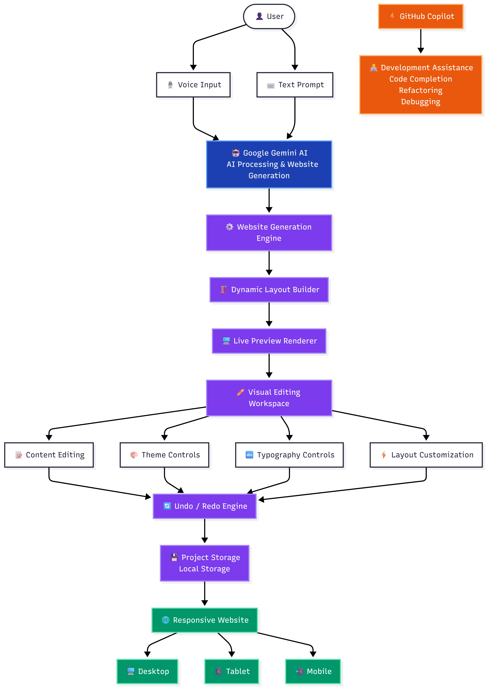

<div align="center">

# 🚀 AntiGravity Studio

### Turn Ideas Into Beautiful Websites Using AI

Transform natural language prompts into modern, responsive, production-ready websites in seconds.

### 🎙️ Voice → 🤖 AI → ✨ Website

<p>
<strong>🏆 Official Submission for Microsoft AI Skill Fest — Agent League Hackathon 2026</strong>
</p>

<br>

<a href="https://antigravity-studio-gules.vercel.app/workspace">

</a>

 

<a href="https://youtu.be/YDpMD4-2H7k">

</a>

 

<a href="https://github.com/gauravbuildz/Antigravity-studio">

</a>

<br><br>


</div>

---

# 🚀 One-Line Pitch

**AntiGravity Studio transforms ideas into fully responsive websites using AI-powered generation, voice input, and live visual editing.**

---

# 🎬 Demo

## 🌐 Live Application

https://antigravity-studio-gules.vercel.app/workspace

## 🎥 Demo Video

https://youtu.be/YDpMD4-2H7k

## 💻 GitHub Repository

https://github.com/gauravbuildz/Antigravity-studio

---

# 🌟 The Problem

Creating a professional website traditionally requires:

* Designing layouts manually
* Writing frontend code
* Managing responsiveness
* Styling components
* Continuous iteration
* Significant development time

For founders, students, freelancers, and developers, transforming an idea into a polished website can take hours or even days.

---

# 💡 The Solution

AntiGravity Studio leverages Google Gemini AI to transform natural language prompts into responsive websites within seconds.

Simply describe your idea:

```text
Create a modern AI SaaS landing page.

Include:
• Hero Section
• Features Grid
• Testimonials
• Pricing Section
• Call-to-Action

Use a dark theme and premium design.
```

The platform automatically generates:

* Responsive Layouts
* Modern UI
* Structured Sections
* Mobile Optimization
* Editable Content
* Production-Ready Designs

---

# ✨ Core Features

| Feature                  | Description                         |
| ------------------------ | ----------------------------------- |
| 🤖 AI Generation         | Generate websites from prompts      |
| 🎙️ Voice Input          | Speak your idea naturally           |
| ✏️ Live Editing          | Edit directly inside preview        |
| 🎨 Design Controls       | Themes, colors, spacing, typography |
| 🔄 Undo / Redo           | Safe experimentation                |
| 💾 Project Saving        | Continue work anytime               |
| 📱 Responsive Design     | Mobile-first layouts                |
| ⚡ Fast Iteration         | Rapid refinement workflow           |
| 🖼️ Smart Image Handling | Improved visual consistency         |

---

## 📸 Screenshots

| Login Experience | Workspace Dashboard |
|-----------------|---------------------|
|  |  |

<br>

### 🚀 Generated Website Preview


### 🏗️ Architecture Diagram



---

# ⚡ Technical Highlights

* Powered by Google Gemini AI
* Dynamic Website Generation
* Voice-Based Website Creation
* Live Visual Editing
* Real-Time Design Controls
* Responsive Layout Generation
* Undo / Redo State Management
* Persistent Project Storage
* Mobile-First Experience

---

# 💻 Tech Stack

| Layer                 | Technology        |
| --------------------- | ----------------- |
| Frontend              | Next.js 16        |
| Framework             | React 19          |
| Language              | TypeScript        |
| Styling               | Tailwind CSS      |
| AI Engine             | Google Gemini API |
| State Management      | React Hooks       |
| Storage               | Local Storage     |
| Deployment            | Vercel            |
| Development Assistant | GitHub Copilot    |

---

# 🤖 GitHub Copilot Usage

GitHub Copilot was used during development for:

* Code completion
* Refactoring assistance
* Boilerplate generation
* Productivity improvements

All architecture decisions, feature implementation, testing, debugging, and final project integration were completed by the developer.

---

# 📂 Project Structure

```text
AntiGravity-Studio/
│
├── screenshots/
│   ├── login-page.png
│   ├── workspace-dashboard.png
│   ├── generated-website.png
│   └── architecture-diagram.png
│
├── src/
│   ├── app/
│   │   ├── api/
│   │   │   ├── auth/
│   │   │   │   ├── login/
│   │   │   │   └── signup/
│   │   │   └── generate-site/
│   │   ├── workspace/
│   │   ├── layout.tsx
│   │   ├── page.tsx
│   │   └── globals.css
│   │
│   └── lib/
│
├── README.md
├── package.json
├── next.config.ts
└── .gitignore
```

---

# 📈 Impact

### Traditional Workflow

Design → Development → Responsiveness → Testing → Iteration

⏱️ Hours or Days

### AntiGravity Studio Workflow

```text
Describe Idea
      ↓
Generate
      ↓
Edit
      ↓
Customize
      ↓
Launch
```

⏱️ Minutes

### Benefits

* ⚡ Faster Website Prototyping
* 🤖 AI-Powered Creation
* 📱 Responsive by Default
* 🎨 Better Design Iteration
* 🎙️ Voice-Based Workflow
* 🚀 Increased Productivity

---

# 🔮 Future Roadmap

* Multi-Page Website Generation
* Export React / Next.js Code
* Export HTML/CSS
* Cloud Synchronization
* Team Collaboration
* Template Marketplace
* One-Click Deployment
* Advanced AI Design Refinement

---

# 👨‍💻 Developer

**Gaurav Kumar**

GitHub: https://github.com/gauravbuildz

Project Repository: https://github.com/gauravbuildz/Antigravity-studio

---

# 🙏 Acknowledgments

* Google Gemini AI
* GitHub Copilot
* Next.js
* React
* Tailwind CSS
* Vercel
* Microsoft AI Skill Fest

---

# 📄 License

MIT License

---

<div align="center">

## ⭐ Turning Ideas Into Websites With AI

### From Prompt to Production-Ready Website in Minutes

</div>
