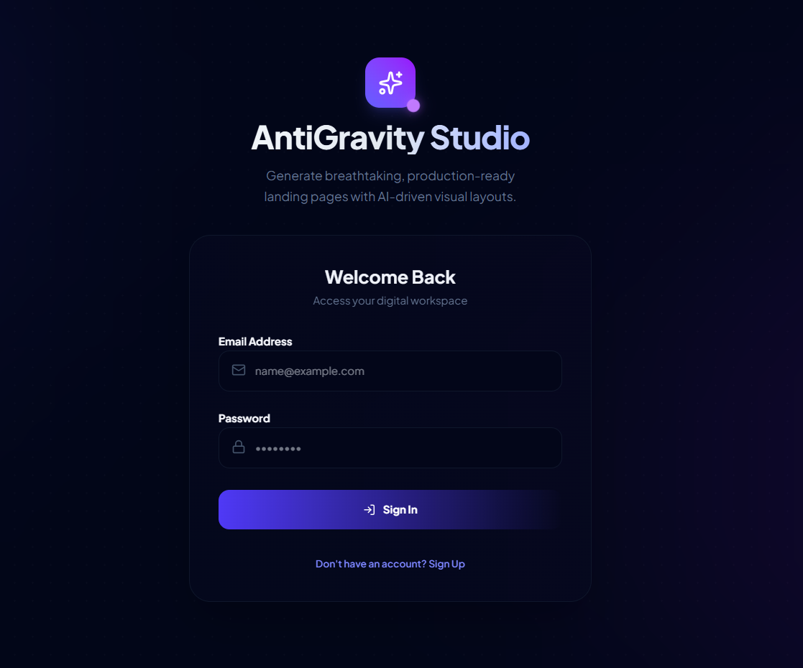
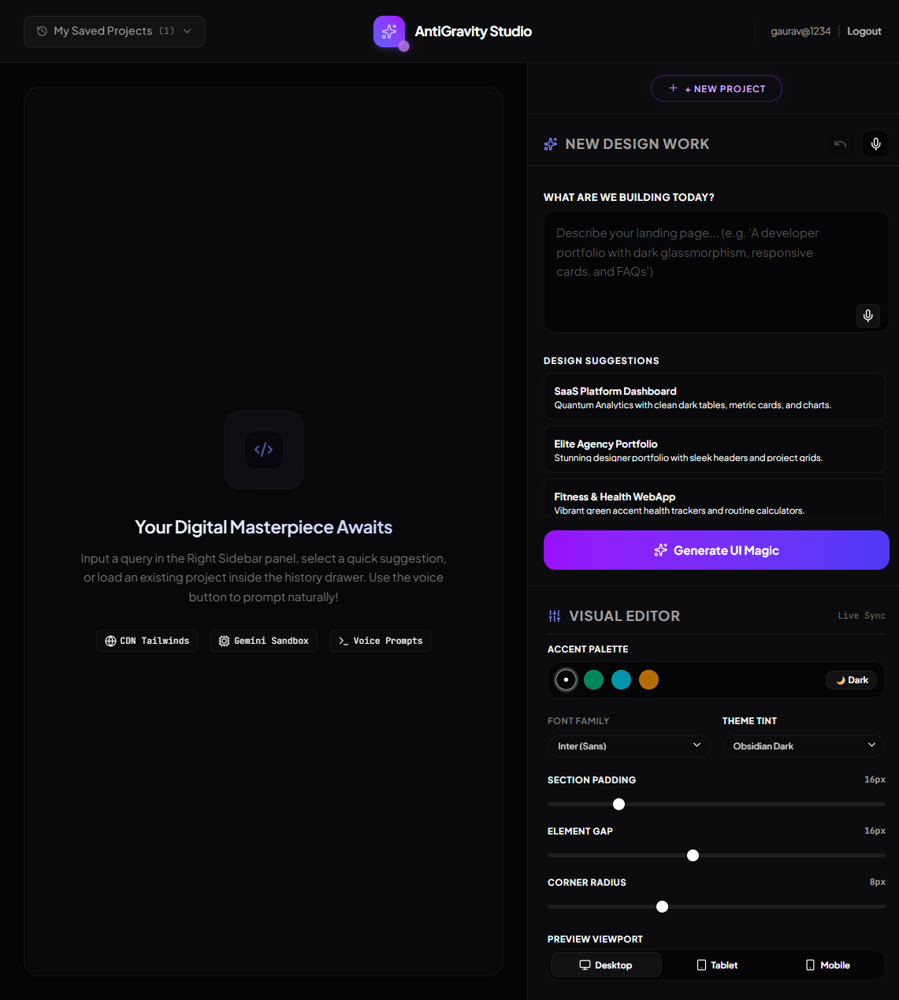

# 🌌 AntiGravity Studio

> AI-Powered No-Code Website Builder with Real-Time Visual Editing


---

## 🔗 Live Demo

🚀 Experience AntiGravity Studio Live:

https://antigravity-studio-gules.vercel.app/workspace

---

## 🖤 Overview

AntiGravity Studio is an AI-powered website builder that enables developers, students, creators, and entrepreneurs to generate stunning, responsive landing pages using natural language prompts.

Powered by Google Gemini AI, the platform transforms ideas into fully styled Tailwind CSS layouts within seconds while providing a real-time visual editing experience.

Users can generate, customize, preview, edit, and save websites without manually writing frontend code.

---

## 🌟 Why AntiGravity Studio?

Building modern websites often requires frontend expertise, design skills, and significant development time.

AntiGravity Studio solves this problem by combining AI-powered website generation with real-time visual editing.

The platform enables users to:

* Transform ideas into websites using natural language
* Generate responsive layouts instantly
* Customize designs without coding
* Edit content directly inside the preview
* Save and continue projects anytime
* Accelerate prototyping and MVP development

Whether you're a developer, student, startup founder, or designer, AntiGravity Studio helps turn concepts into production-ready interfaces faster.

---

## ✨ Features

### 🤖 AI Website Generation

Generate complete landing pages using natural language prompts powered by Google Gemini AI.

### 🎙️ Voice Prompt Support

Generate websites using voice commands.

### 🎨 Visual Editor

Customize generated websites with:

* Font Controls
* Accent Colors
* Theme Switching
* Border Radius
* Padding Controls
* Gap Controls

### ✏️ Inline Content Editing

Edit website content directly inside the preview canvas.

### 🔄 Undo / Redo System

Track and restore design changes instantly.

### 💾 Saved Projects

Store and reopen previously generated projects.

### 📱 Responsive Preview

Preview websites across:

* Desktop
* Tablet
* Mobile

### 🌙 Obsidian Dark UI

Modern developer-focused interface inspired by Vercel and Linear.

---

## 📸 Screenshots

### Login Page



### Workspace Dashboard



### Generated Website Preview


---

## 🔄 Application Workflow

### Step 1 — Authentication

User signs up or logs into AntiGravity Studio.

↓

### Step 2 — Prompt Input

User enters a website description using text or voice input.

Examples:

* SaaS Dashboard
* AI Startup Landing Page
* Fitness Website
* Luxury Watch Store
* Portfolio Website

↓

### Step 3 — AI Processing

Google Gemini AI analyzes:

* Website Structure
* Content Sections
* UI Components
* Design Patterns
* Tailwind Styling

↓

### Step 4 — Layout Generation

The platform generates a responsive website layout.

↓

### Step 5 — Live Preview

Generated website appears instantly inside the preview canvas.

↓

### Step 6 — Visual Editing

Users can modify:

* Fonts
* Colors
* Padding
* Radius
* Layout Spacing

↓

### Step 7 — Inline Editing

Users can directly edit website content inside the preview.

↓

### Step 8 — History Tracking

Every change is stored for Undo / Redo functionality.

↓

### Step 9 — Project Saving

Projects can be saved and restored later.

↓

### Step 10 — Final Output

Responsive production-ready website ready for deployment.

---

## 🏗️ System Architecture

User

↓

Prompt / Voice Input

↓

Google Gemini AI

↓

Layout Generation Engine

↓

Live Preview Canvas

↓

Visual Editor

↓

Undo / Redo Manager

↓

Project Storage

↓

Responsive Website Output

---

## 🚀 Future Roadmap

* Export generated websites as code
* One-click deployment
* Multi-page website generation
* Team collaboration support
* Figma-to-Website generation
* AI design suggestions
* Template marketplace

---

## 🧠 Smart AI Framework

### Dynamic Prompt Processing

The system converts user prompts into structured website layouts using Google Gemini AI.

### Intelligent Layout Generation

AI automatically generates:

* Hero Sections
* Features Sections
* Pricing Blocks
* Testimonials
* Call-To-Action Components

### Smart Fallback System

If AI generation becomes unavailable, category-based layouts are generated automatically.

Supported Categories:

* SaaS
* Analytics
* Portfolio
* Fitness
* Wellness
* Luxury Products
* E-commerce

---

## 📂 Project Structure

```text
src/
├── app/
│   ├── api/
│   │   ├── auth/
│   │   │   ├── login/
│   │   │   └── signup/
│   │   └── generate-site/
│   ├── workspace/
│   ├── globals.css
│   ├── layout.tsx
│   └── page.tsx
│
├── lib/
│   └── db.ts

AGENTS.md
README.md
package.json
next.config.ts
```

---

## 🛠️ Tech Stack

### Frontend

* React
* Next.js
* TypeScript
* Tailwind CSS

### AI

* Google Gemini API

### Backend

* Next.js API Routes

### Storage

* Local Storage
* History Management

---

## ⚙️ Local Setup

### Install Dependencies

```bash
npm install
```

### Configure Environment Variables

Create `.env.local`

```env
GEMINI_API_KEY=your_api_key
JWT_SECRET=your_secret_key
```

### Run Development Server

```bash
npm run dev
```

Open:

```text
http://localhost:3001
```

### Type Checking

```bash
npx tsc --noEmit
```

---

## 🎥 Demo Video

Demo Video Link:

(Add Your Video Link Here)

---

## 👨‍💻 Author

**Gaurav Kumar**

* GitHub: https://github.com/gauravbuildz
* Project: AntiGravity Studio

Built with 💜 using Next.js, Tailwind CSS, TypeScript, and Google Gemini AI.
